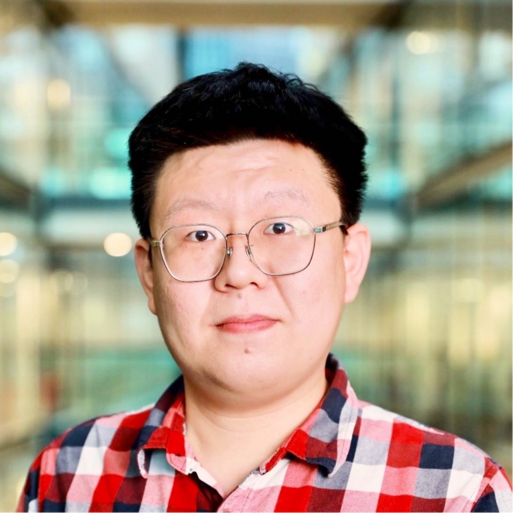

:::: {.columns}

::: {.column width="50%"}
{width="300px"}

### Yuanheng Li
**Instructor**

Visiting lecturer at the Bayes Business School. Graduated from the Bayes MSc in
Business Analytics in 2023, and now a data analyst at EY.

📬 [Yuanheng.Li.2@city.ac.uk](mailto:Yuanheng.Li.2@city.ac.uk)
:::

::: {.column width="50%"}
{width="290px"}

### Simone Santoni
**Module leader**

Associate professor in strategy at the Bayes Business School

📬 [Simone.Santoni.1@city.ac.uk](Simone.Santoni.1@city.ac.uk)
:::

::::
