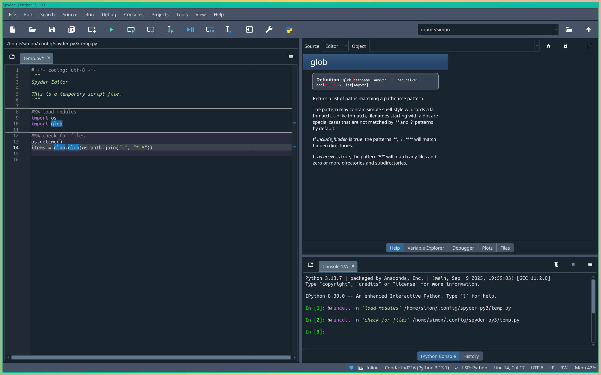
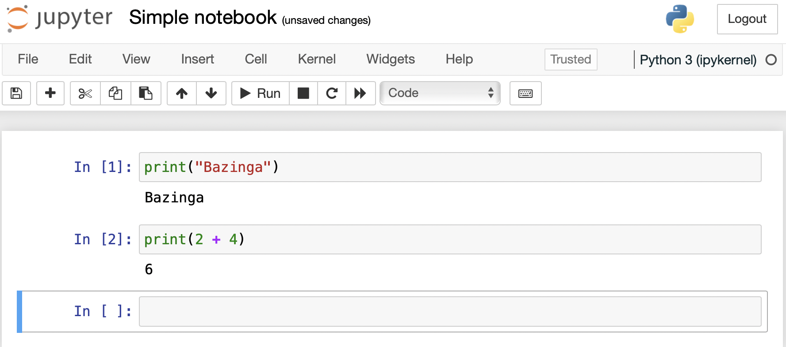
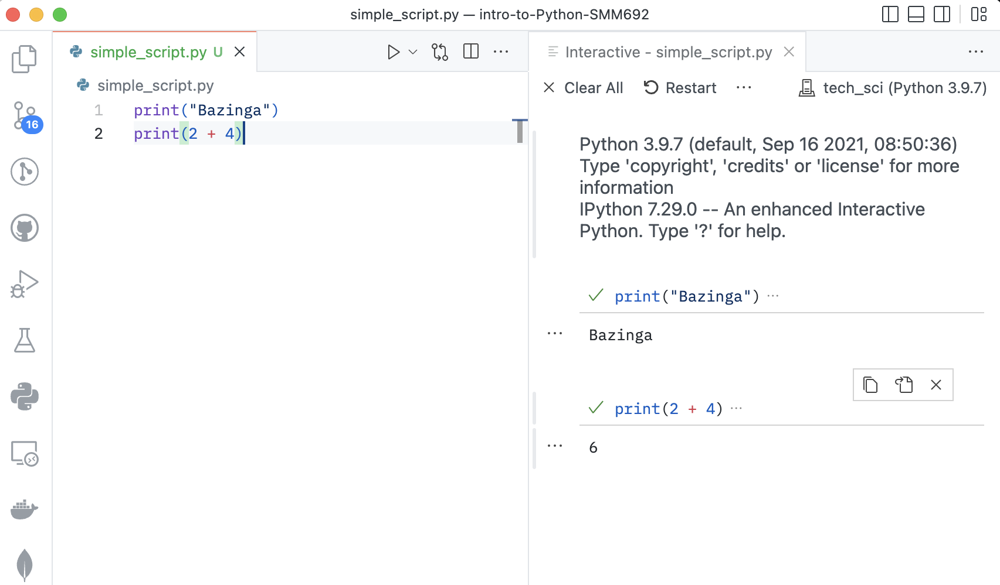
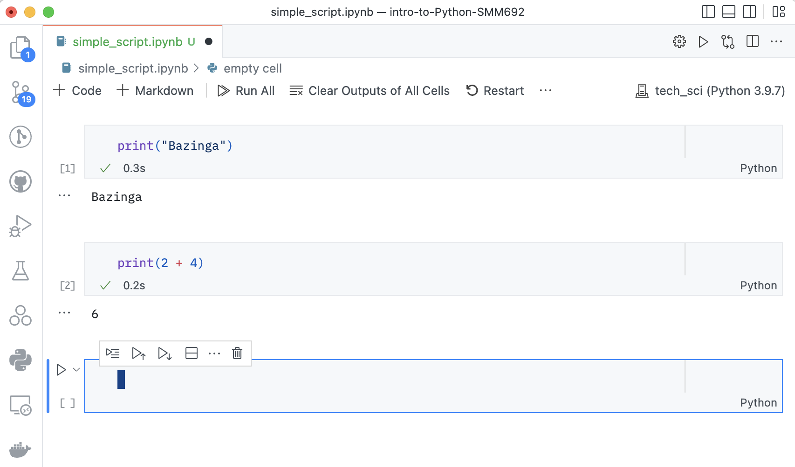

Now that you understand how Python runs programs internally, let's explore the practical ways to execute Python code. There are several methods available, each suited for different scenarios and learning styles.

## What Are the Alternative Ways to Run Python Code?

There are **two main approaches** to running Python code:

1. **Non-interactive way** - Preparing a Python script and running it from the command line
2. **Interactive way** - Preparing and running one or a few Python statements from within a Python shell

Let's explore each approach in detail.

## Non-Interactive Execution: Running Python Scripts

The non-interactive approach involves a **two-step process**:

1. **First**, the script has to be prepared using a text editor
2. **Second**, the script has to be executed from the shell

### Creating a Python Script

A Python script can be created using:
- Built-in text editor of your operating system
- Advanced text editors such as:
  - [Atom](https://atom.io)
  - [Emacs](https://www.gnu.org/software/emacs/)
  - [Vim](https://www.vim.org)/[Neovim](https://neovim.io)
  - [Sublime Text](https://www.sublimetext.com)
  - [Visual Studio Code](https://code.visualstudio.com)

Here's a minimal Python script example:

```python
# Print a string object
print("Bazinga")

# Print the result of an algebraic operation
print(2 + 4)
```

### Executing the Script

Once the script is saved to a file with extension `.py`, you can execute it from the command line:

```bash
$ python filename.py
```

Let's break down this command:
- The `$` symbol denotes the statement has to be run in a shell session
- The `python` command tells the shell to use the Python interpreter to evaluate the script
- `filename.py` is the script's file name

::: {.warning-box}
### Important Note

The example assumes the Python script is saved in the current working directory. If the script is saved in a different directory, you have to specify the full path to the script in the command line.
:::

```bash
$ python simple_script.py
Bazinga
6
```

The outcome of the script is displayed in the active shell session. You'll see the `print` function in action throughout your Python journey.

## Interactive Execution: Python Shells

Interactive execution allows you to test code snippets quickly and experiment with Python commands in real-time.

### Three Ways to Run Python Interactively

1. **Running a Python shell in the terminal**
2. **Running an IPython shell in the terminal**
3. **Interacting with a Python or IPython shell through an Integrated Development Environment (IDE)**

### Using Python and IPython Shells

To start an interactive session:

1. Open your terminal emulator of choice:
   - Windows Terminal
   - Cmder
   - iTerm
   - Terminator
   - Kitty

2. Run one of these commands:
   ```bash
   $ python    # Start a Python shell
   $ ipython   # Start an IPython shell (enhanced)
   ```
3. You will be prompted into this:
   ```bash
   Python 3.12.2 | packaged by conda-forge | (main, Feb 16 2024, 20:50:58) [GCC 12.3.0]
   Type 'copyright', 'credits' or 'license' for more information
   IPython 8.30.0 -- An enhanced Interactive Python. Type '?' for help.

   In [1]: print("Bazinga")
   Bazinga

   In [2]: print(2 + 4)
   6
   ```

::: {.callout-note}
## Advantages of IPython

- **Syntax highlighting** for better code readability
- **Tab completion** for faster coding
- **Magic commands** for enhanced functionality
- **Better error messages** and debugging capabilities
:::

## Popular Python IDEs

There are numerous Python IDEs available, each with unique features:

### Cloud-Based IDEs
- **Google Colab** - Free, runs in browser, great for data science
- **Datalore** - JetBrains' cloud-based data science platform

### Desktop IDEs
- **IDLE** - Comes with Python installation, simple and lightweight
- **Jupyter/JupyterLab** - Interactive notebooks, excellent for data analysis
- **PyCharm** - Professional IDE with advanced features
- **Spyder** - Scientific Python development environment
- **Thonny** - Beginner-friendly Python IDE
- **Wing** - Professional Python IDE
- **Qt Console** - Enhanced console interface

## Which IDE should I use?

If you are a Python newbie, **Spyder and Jupyter are excellent options**
because they are specifically designed with beginners and data science
workflows in mind.

### How about Spyder?

Spyder (Scientific Python Development Environment) is particularly well-suited for Python beginners because:

- **Familiar interface** - Similar to MATLAB or RStudio, making it comfortable for users coming from those environments
- **RStudio-like experience** - If you're already familiar with RStudio for R programming, Spyder provides a very similar layout with panels for editor, console, variable explorer, and help - making the transition to Python seamless
- **Built-in help** - Integrated documentation and help panels
- **Variable explorer** - See your variables and their values in real-time
- **Integrated IPython console** - Interactive Python shell built right in
- **Debugging tools** - Easy-to-use debugger for finding and fixing errors
- **Scientific focus** - Designed specifically for data analysis and scientific computing

::: {.figure}
{width="95%"}
:::

### How about Jupyter?

**Absolutely!** Jupyter supports novice programming learning in two important ways:

- **Trial and Error Approach:** The graphical interface of a Jupyter notebook allows learners to embrace a trial and error approach to coding by:
  - **Breaking code into manageable chunks** - Dissect scripts into small, testable snippets
  - **Immediate feedback** - See results instantly after running each cell
  - **Easy experimentation** - Modify and re-run code without affecting other parts
  - **Step-by-step execution** - Execute code line by line or cell by cell to understand each step

- **Rich Documentation and Learning:** Jupyter notebooks provide an ideal environment for learning because they combine:
  - **Code and explanations** - Mix executable code with markdown text explanations
  - **Visual outputs** - Display plots, charts, and rich media directly in the notebook
  - **Interactive learning** - Create tutorials that students can follow along with
  - **Reproducible examples** - Share complete workflows that others can run and learn from

::: {.figure}
{width="95%"}
:::

These features make Jupyter particularly valuable for:
- **Learning Python concepts** - Experiment with new ideas safely
- **Data analysis workflows** - Perfect for exploring and visualizing data
- **Creating educational content** - Ideal for tutorials and examples
- **Documenting your work** - Combine code, results, and explanations in one place

::: {.warning-box}
### Exercise: Try Different Execution Methods

1. **Create a simple script**:
   - Save the following code as `hello_world.py`:
   ```python
   print("Hello, Python world!")
   name = input("What's your name? ")
   print(f"Nice to meet you, {name}!")
   ```

2. **Run it from command line**:
   ```bash
   python hello_world.py
   ```

3. **Try the same code in an interactive shell**:
   - Start Python: `python`
   - Type each line and press Enter
   - Exit with `exit()`

4. **If available, try in Jupyter**:
   - Start Jupyter: `jupyter lab` or `jupyter notebook`
   - Create a new notebook
   - Run the code in cells
:::

## Advanced Text Editors as Python IDEs

You can transform advanced text editors into powerful Python IDEs by installing
plugins:

### Popular Editor Options
- **Emacs** - Highly customizable, steep learning curve
- **Vim/Neovim** - Modal editing, very efficient once learned
- **Visual Studio Code (VSCode)** - Modern, user-friendly, extensive plugin ecosystem

### VSCode for Python Development

VSCode is particularly popular among data scientists because it offers:
- Excellent Python extension
- Integrated terminal
- Git integration
- Debugging capabilities
- Jupyter notebook support

::: {.figure}
{width="95%"}
:::

::: {.figure}
{width="95%"}
:::

For detailed setup instructions, refer to the [official VSCode Python
documentation](https://code.visualstudio.com/docs/languages/python).

## Choosing the Right Method

The choice of execution method depends on your needs:

### Use **Scripts** when:
- Building complete applications
- Automating tasks
- Sharing code with others
- Working on larger projects

### Use **Interactive shells** when:
- Learning new concepts
- Testing small code snippets
- Debugging
- Exploring data

### Use **IDE like Spyder or Jupyter** when:
- Doing data analysis
- Creating tutorials or documentation
- Prototyping
- Combining code with explanations

## Quick Reference

```bash
# Running scripts
python script.py         # Run a Python script
python -i script.py      # Run script then enter interactive mode

# Interactive shells
python                   # Start Python shell
ipython                  # Start IPython shell (if installed)
exit()                   # Exit Python shell

# Jupyter
jupyter lab              # Start Jupyter Lab
jupyter notebook         # Start Jupyter Notebook
```

## Summary

You now know the main ways to execute Python code:

1. **Non-interactive execution** using scripts and the command line
2. **Interactive execution** using Python/IPython shells
3. **IDE-based execution** using integrated development environments
4. **Notebook-based execution** using Jupyter

Each method has its place in the Python developer's toolkit. As you progress,
you'll likely use all of these methods depending on the task at hand.

## Next Steps

Now that you understand how to run Python programs, let's explore [Managing
Python Environments](managing-python-environments.qmd) to learn how to organize
your Python projects and dependencies effectively.
