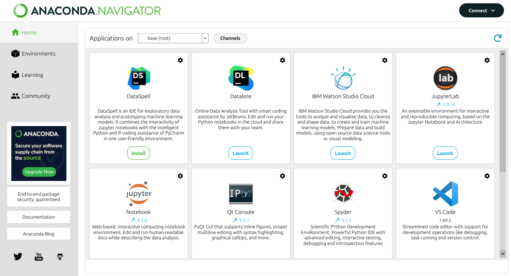

## How can I install Python?

There are two options:

- Using the [official installer](https://www.python.org/downloads/)
- Using the [Anaconda Distribution](https://www.anaconda.com/products/distribution) of Python (preferred option)

## What are the distinctive features of Anaconda?

- Anaconda is 'battery-included' — it comes with a humongous number of modules for data science
  - If you use the official Python installation, you must install the modules you need on your own!
- Anaconda is a bundle of various pieces of software:
  - `conda` is the Swiss army knife to manage Python modules and environments
  - Anaconda Navigator is the graphical interface from within to access Python IDEs and related desktop/web applications

## What are the steps to install Anaconda?

Here are the steps:

1. **Download the installer** for your operating system (unless you have a very old machine running Windows, go for the 64-Bit version)

2. **Run the installer**
   - **For Linux:** navigate to the folder where you have downloaded the installer as per step 1, open a shell session, then run:
     ```bash
     $ bash ./Anaconda3-XXXX.XX-Linux-x86-64.sh
     ```
   - **For Windows and Mac OS:** just run the graphical installer downloaded in step 1

3. **Accept the terms** proposed by the Anaconda people to use their software, comprising Python, the `conda` package manager, and a bundle of modules for data science

4. **That's it!**
   - **For Linux users:** if you accepted the default installation options, an environmental variable is created either in your `.bashrc` or `.zshrc`. That means you can access the various pieces of software included in the Anaconda installation (e.g., Anaconda Navigator) from a shell session
   - **For Windows and Mac OS users:** the various pieces of software included in the Anaconda installation are available from the menu of your system

## What are the pieces of software included in Anaconda?

There are plenty of applications included in the Anaconda installation. These applications can be accessed from within Anaconda Navigator, available in the launcher of your operating system.

::: {.figure}
{width="100%"}
:::

### Integrated Development Environments (IDEs)

Popular choices for Python development:

- **VS Code**: Free, lightweight, excellent Python support
- **PyCharm**: Full-featured IDE with advanced debugging tools
- **Spyder**: Designed specifically for scientific Python

### Jupyter Lab/Notebook

Jupyter is an interactive environment perfect for data analysis and learning Python.

Starting Jupyter:
- Open Anaconda Navigator and click "Launch" under Jupyter Lab
- Or from command line:
  ```bash
  jupyter lab
  ```

**Benefits of Jupyter**:
- Interactive code execution
- Mix code, text, and visualizations
- Great for experimentation and prototyping
- Industry standard for data analysis

## Package Management with conda

Conda is a package manager that comes with Anaconda. It helps you install and manage Python packages.

### Setting up the Course Environment

We've provided an `env.yml` file in the repository that includes all necessary packages for this course. You can create the environment using:

```bash
# Create environment from the env.yml file
conda env create -f env.yml

# Activate the environment
conda activate ind219
```

Alternatively, you can create the environment manually:

```bash
# Create a new environment for this course
conda create -n ind219 python=3.13

# Activate the environment
conda activate ind219

# Install essential packages
conda install -c conda-forge numpy pandas matplotlib jupyter

# List installed packages
conda list

# Deactivate environment when done
conda deactivate
```

## Essential Packages for Analytics

Here are the key packages we'll use throughout the course:

```python
import numpy as np          # Numerical computing
import pandas as pd         # Data manipulation
import matplotlib.pyplot as plt  # Basic plotting

# Check if packages are working
print(f"NumPy version: {np.__version__}")
print(f"Pandas version: {pd.__version__}")
```
## Quick Reference

```bash
# Running Python code
python script.py           # Run a Python file
python -i script.py        # Run and enter interactive mode
jupyter lab                # Start Jupyter Lab

# Package management
conda install package      # Install a package
conda list                 # List installed packages
pip install package        # Alternative package installer
```
## Next Steps

Now that you have Python set up, you're ready to dive deeper into Python objects and data types. Continue to [Python Objects](../module-2/index.qmd) to learn about the fundamental building blocks of Python programming.


